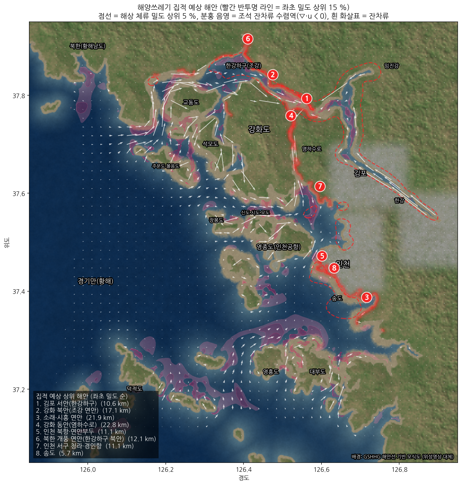
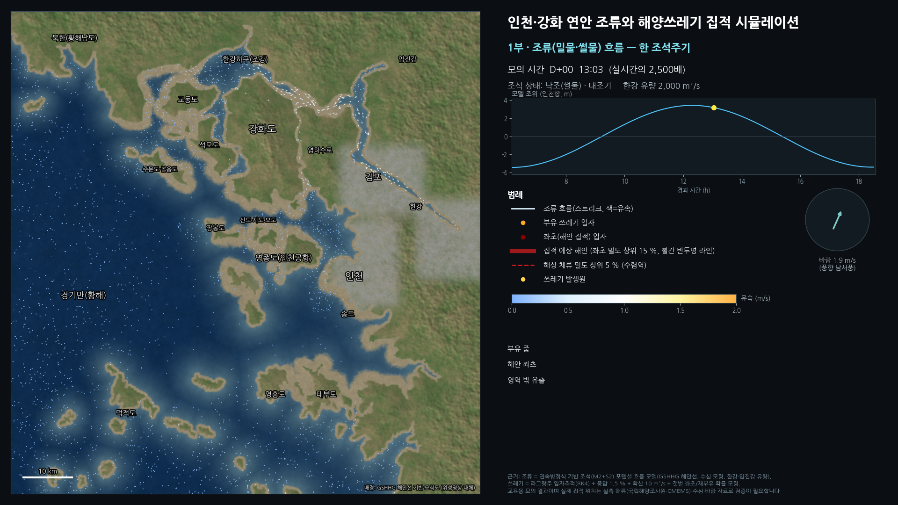
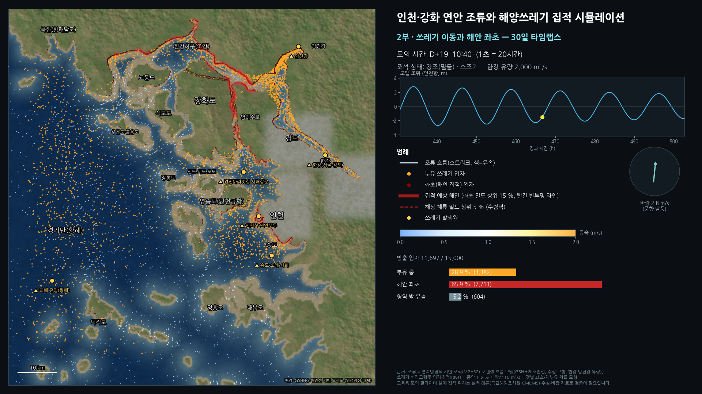
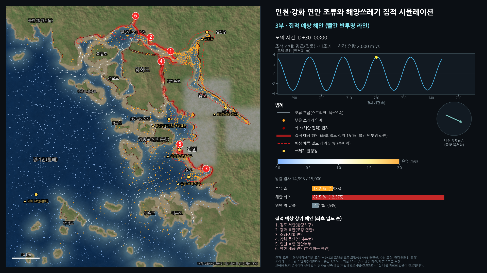
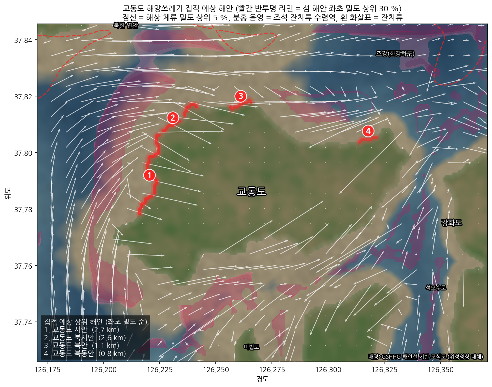
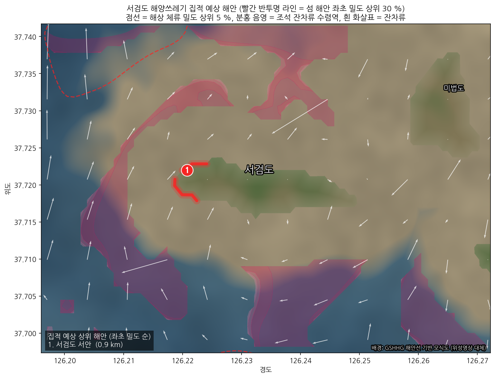
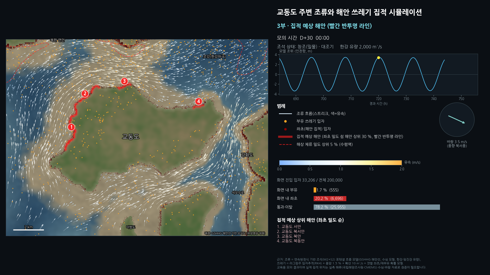
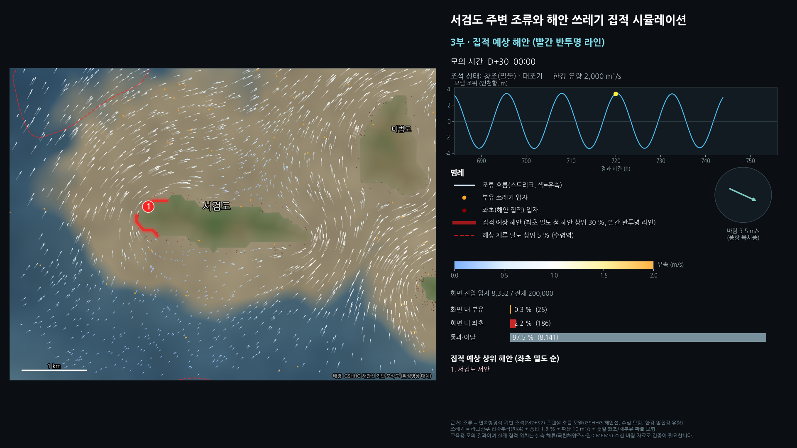

# 인천·강화 연안 조류 흐름과 해양쓰레기 집적 시뮬레이션

인천 앞바다(경기만 북부)와 강화도 주변의 **조류(밀물·썰물) 흐름**을 계산하고, 그 흐름을 따라 떠다니는
**해양쓰레기가 어디에 모이는지**를 라그랑주 입자추적으로 모의한 뒤, 결과를 **영상(MP4)** 으로 만드는 파이프라인입니다.

| 산출물 | 설명 |
|---|---|
| `output/incheon_debris_simulation.mp4` | 1080p 63초 영상: 타이틀 → 조류 흐름(한 조석주기) → 쓰레기 이동·좌초 30일 타임랩스 → 집적 예상 해안(빨간 반투명 라인) |
| `output/hotspot_map.png` | 최종 집적 예상 지도(빨간 반투명 라인 + 순위 + 잔차류 수렴역) |
| `output/hotspots_ranked.json`, `output/hotspots.geojson` | 집적 예상 해안 순위 표와 GIS용 라인(GeoJSON, WGS84) |
| `output/frame_*.png` | 영상 주요 장면 |
| `output/gyodong_debris_simulation.mp4`, `output/seogeom_debris_simulation.mp4` | **섬 상세 영상**: 교동도·서검도 범위로 확대, 섬 자체 해안선 기준 집적 구간만 빨간 반투명 라인으로 표시 (100 m 격자, 200,000 입자) |
| `output/hotspot_map_gyodong.png`, `output/hotspot_map_seogeom.png`, `output/hotspots_{gyodong,seogeom}_ranked.json`, `.geojson` | 섬별 집적 예상 지도·순위(8방위 구간)·GIS 라인 |

> **중요:** 이 저장소의 영상은 인터넷이 차단된 환경에서 만들었기 때문에
> (1) 배경은 실제 위성사진이 아니라 GSHHG 해안선으로 그린 *위성풍 모식 지도*이고,
> (2) 조류는 실측 자료가 아니라 *조석 연속방정식 기반 모델*입니다.
> 인터넷이 되는 PC에서 `python run_all.py` 를 실행하면 **Esri 위성영상 타일**을 자동으로 받아 배경에 깔고,
> `--nc` 옵션으로 **국립해양조사원·Copernicus·HYCOM 실측/예측 해류**를 넣어 같은 영상을 다시 만들 수 있습니다
> (아래 "실측 자료로 교체하기").



| 1부 조류 흐름 | 2부 30일 타임랩스 | 3부 집적 예상 해안 |
|---|---|---|
|  |  |  |

---

## 1. 해류(조류) 데이터는 어디서 구하나

인천·강화 해역은 조차가 최대 9 m에 이르는 **대조차 해역**이라 "해류"의 대부분이 **조류(tidal current)** 입니다.
따라서 (a) 조석 모델/조류 예보와 (b) 해양순환 예측모델 두 가지를 함께 보는 것이 좋습니다.

| 구분 | 자료 | 제공 | 해상도 / 특징 | 접근 |
|---|---|---|---|---|
| 조류 관측·예보 | **국립해양조사원 바다누리 해양정보서비스 Open API** (조위·조류 관측, 조류 예보, 조석 예보) | KHOA | 인천항·강화대교·영종대교 등 관측소 지점 시계열 | www.khoa.go.kr/oceangrid 무료 API 키 |
| 조류도 | 국립해양조사원 **조류도/조류 예측 정보** (인천항 접근수로 등) | KHOA | 시각별 조류 벡터 도면 | 바다누리 "해양예측·조류" |
| 격자 해류 예측 | **KOOS 한국 운용해양예보시스템** (서해·경기만 상세 모델) | KIOST | 수백 m~수 km 격자, 조석 포함 | koos.kiost.ac.kr |
| 격자 해류 (전지구) | **Copernicus Marine** `GLOBAL_ANALYSISFORECAST_PHY_001_024` (`cmems_mod_glo_phy_anfc_0.083deg_PT1H-m`, 시간별 표층 유속, 조석 포함) | EU CMEMS | 1/12° (~8 km) | 무료 계정, `copernicusmarine` 파이썬 툴박스 |
| 격자 해류 (전지구) | **HYCOM GOFS 3.1** (GLBy0.08) | 미 해군/HYCOM | 1/12°, 3시간 | THREDDS/NCSS, 계정 불필요 (조석 포함 여부는 실험별 문서 확인) |
| 조석 조화상수 모델 | **TPXO9-atlas** (OSU), **FES2014/2022** (AVISO+), **NAO.99Jb** (한·일 근해) | 각 기관 | 1/30°~1/12°, 분조별 조류 타원 → 임의 시각 조류 계산(`pyTMD`) | 학술용 무료 등록 |
| 수심 | **GEBCO 2024** (15초 ≈ 450 m), 국립해양조사원 수치해도·연안 수심 | GEBCO / KHOA | 조류 모델의 핵심 입력 | gebco.net / KHOA |
| 해안선 | GSHHG(이 저장소 사용), OpenStreetMap, 국립해양조사원 해안선 | | 갯벌 경계는 KHOA·OSM이 더 정확 | |
| 바람 | **기상청 기상자료개방포털** (인천·강화·덕적도 ASOS/AWS, 해양기상부이), **ERA5** | KMA / ECMWF | 풍압(windage) 계산 | data.kma.go.kr / CDS |
| 하천 유량 | **한강홍수통제소** (한강대교·전류리, 임진강), WAMIS | 환경부 | 한강 쓰레기 유입 시나리오 | hrfco.go.kr |
| 쓰레기 실측(검증) | **해양환경공단(KOEM) 국가 해안쓰레기 모니터링**, 해양환경정보포털(MEIS), 인천시·옹진군·강화군 수거 통계 | KOEM 등 | 모델 결과 검증·보정 | meis.go.kr |

전지구 모델(CMEMS·HYCOM)은 8 km 격자라 염하수로·석모수로 같은 좁은 수로를 표현하지 못합니다.
실제 연구/영상 제작용으로는 **KHOA 조류 관측·예보 + 조석 조화상수 모델(TPXO/FES) + GEBCO 수심** 조합이나
**KOOS 경기만 상세 모델** 결과를 쓰는 것이 가장 좋습니다.

## 2. 쓰레기가 많이 모이는 곳은 어떻게 계산하나 (근거)

자세한 수식과 참고 문헌은 [`docs/데이터_출처_및_계산_근거.md`](docs/데이터_출처_및_계산_근거.md) 에 있습니다. 요약:

1. **라그랑주 입자추적(Lagrangian particle tracking)** – 쓰레기를 수천~수만 개의 가상 입자로 보고
   `dx/dt = u_해류(x,t) + c_w·W_바람(t) + 난류 확산` 을 4차 Runge–Kutta 로 적분합니다
   (풍압계수 c_w ≈ 1–3 %, 확산계수 K ≈ 10 m²/s). 전 세계적으로 OpenDrift, OceanParcels 가 같은 방식입니다.
2. **좌초(beaching)와 재부유** – 입자가 해안(갯벌) 셀에 닿으면 확률 `P_BEACH` 로 좌초, 좌초 입자는 하루 `P_REFLOAT`
   확률로 다시 떠오릅니다. 인천·강화는 갯벌이 넓어 좌초가 잦고 재부유는 적습니다.
3. **집적 지표** – (a) *해안 좌초 밀도*: 해안 1 km 당 좌초 입자 수를 가우시안 평활(σ ≈ 1 km) → **상위 15 % 구간을 빨간 반투명 라인**으로 표시,
   (b) *해상 체류 밀도*: 마지막 15일 부유 입자 밀도 상위 5 % (점선), (c) *잔차류 수렴역*: 조석 2주기 평균 라그랑주 잔차류 `u_res` 의 발산
   `∇·u_res < 0` 인 곳(분홍 음영) – 부유물은 발산이 음수인 곳(수렴역, 와류 중심, 전선, 섬 뒤 정체역)에 모입니다.
4. **물리적 근거** – 대조차 해역의 순수송은 조석 비선형성(조석 정류·Stokes 드리프트) + 하천 유출 + 바람이 결정하며,
   한강 홍수 때 쓰레기가 집중 유입되어 강화 북안·조강, 염하수로, 김포 서안, 강화 남·서안과 영종·장봉·덕적 도서로 확산되는 것이
   국내 모니터링·연구에서 반복적으로 보고됩니다. 모델 결과는 반드시 KOEM 모니터링·수거량과 비교해 `P_BEACH` 등 매개변수를 보정해야 합니다.

## 3. 이 저장소의 모델이 하는 일

```
geodata.py    GSHHG 전해상도 해안선 → 200 m 격자 육지/물 마스크, 해안거리 기반 수심 모형, 주요 수로(염하·석모·인천항·조강) 보정
currents.py   조석 포텐셜 흐름 모델  ∇·(h∇Φ) = ∂η/∂t − R,  u = −∇Φ   (M2+S2, 외해→내만 진폭 증가·위상 지연, 한강·임진강 유량·홍수 펄스)
              ExternalCurrents: 실측/예측 NetCDF(u,v) 를 같은 인터페이스로 공급
particles.py  15,000 입자 · 30일 · dt 5분 · RK4 · 풍압 1.5 % · 확산 10 m²/s · 좌초/재부유
accumulate.py 해안 좌초 밀도, 해상 체류 밀도, 잔차류 수렴역, 구간 분할·지명 부여·순위
basemap.py    위성 타일(Esri/EOX) 다운로드·재투영  /  GSHHG 기반 모식 지도
render.py     1920×1080 30 fps 프레임(스트리크 유속장, 입자, 빨간 집적 라인, 조위·바람·통계 패널) → ffmpeg
```

쓰레기 발생원 시나리오(여름 장마철): 한강 50 %(2~7일차 홍수 펄스에 60 % 집중, 유량 2,000 → 최대 12,000 m³/s),
임진강 10 %, 인천항·연안부두 10 %, 경인아라뱃길 서해갑문 5 %, 송도·소래·시화 10 %, 외해(황해) 유입 15 %.

### 이번 모의의 집적 예상 상위 해안 (좌초 밀도 순)
`output/hotspots_ranked.json` 참고. 한강 하구(김포 서안·강화 북안 조강 연안), 인천 북항·연안부두, 소래·시흥 연안,
강화 동안(염하수로), 김포 대명항·초지, 인천 서구 청라, 교동도·강화 서안(외포리)·석모도 서안 순으로 나왔습니다.
외해 유입 입자는 덕적도·영흥도·장봉도 외측 해안에 좌초했습니다.

## 3-1. 섬 상세 영상 (교동도 · 서검도)

| 교동도 집적 예상 지도 | 서검도 집적 예상 지도 |
|---|---|
|  |  |

| 교동도 영상 장면 | 서검도 영상 장면 |
|---|---|
|  |  |

* 지역 전체 모의를 **100 m 격자 · 200,000 입자**로 다시 돌린 뒤(`simulate --dx 100 --n 200000`), 섬 주변(교동도 ±3 km, 서검도 ±2 km)으로 화면을 좁혀
  같은 영상 구성(조류 흐름 → 30일 타임랩스 → 집적 예상 해안)으로 렌더링했습니다 (`incheon_debris_sim/make_island.py`, `island.py`).
* 빨간 라인은 **그 섬 해안선만을 기준**으로 좌초 밀도 상위 30 % 구간이며, 구간 이름은 섬 중심 기준 8방위(북안·북서안·…)입니다.
  이웃 섬·강화도 해안의 라인은 표시하지 않습니다.
* 서검도(면적 1.4 km²)는 섬이 작아 격자(100 m)로는 ~20셀 폭이고 섬에 닿는 입자 수도 적어 결과의 통계적 신뢰도가 교동도보다 낮습니다.
  정밀한 결과가 필요하면 섬 주변 50 m 격자의 둥지(nested) 모델과 실측 수심·해류가 필요합니다.
* 다른 섬을 추가하려면 `island.py` 의 `ISLANDS` 에 이름·중심 좌표·여백만 넣으면 됩니다 (GSHHG 해안선에서 폴리곤을 자동으로 찾음).

## 4. 실행 방법

```bash
pip install -r requirements.txt          # basemap-data-hires (GSHHG) 와 NanumGothic 포함
python run_all.py                        # 지형 → 위성지도(가능하면) → 조류 → 입자추적 → 분석 → 영상
```
단계별 실행: `python -m incheon_debris_sim.simulate` → `python -m incheon_debris_sim.render` (`--stills` 로 정지화면만).
섬 상세: `python -m incheon_debris_sim.simulate --dx 100 --n 200000 --out output/sim_results_dx100.npz` →
`python -m incheon_debris_sim.make_island gyodong seogeom` (또는 `python run_all.py --islands gyodong seogeom`).
위성 배경을 섬 영상에도 쓰려면 `basemap.fetch_satellite_basemap(bbox=<섬 범위>, zoom=15, path="output/basemap_satellite_gyodong.png")` 처럼
섬 범위 파일을 만들어 두면 자동으로 사용됩니다.
설정은 모두 `incheon_debris_sim/config.py` 에 있습니다 (영역, 격자, 조석 진폭, 유량, 바람, 좌초 확률, 발생원, 지명).

### 실측 자료로 교체하기
```bash
python -m incheon_debris_sim.fetch_data basemap                 # 위성 배경지도 (Esri World Imagery, zoom 12)
python -m incheon_debris_sim.fetch_data hycom --start 2025-07-01T00:00:00 --end 2025-07-31T00:00:00
#  또는  pip install copernicusmarine && copernicusmarine login && python -m incheon_debris_sim.fetch_data cmems ...
python run_all.py --nc data/currents.nc                          # NetCDF (u,v,time,lat,lon) 로 모의
```
`ExternalCurrents(path, dom, var_map=...)` 의 `var_map` 으로 변수명을 지정합니다
(Copernicus: `uo/vo/latitude/longitude/time`, HYCOM: `water_u/water_v/lat/lon/time`).
국립해양조사원 API 의 지점 조류 시계열은 조석 조화분석 후 `TidalFlowModel` 의 진폭·위상 매개변수(`A_M2_OFFSHORE`, `PHASE_SCALE`)를
보정하는 데 쓰거나, 조석 조화상수 격자(TPXO/FES → pyTMD)로 u,v NetCDF 를 만들어 `--nc` 로 넣으면 됩니다.
GEBCO 수심은 `geodata.load_external_depth()` 로 수심 모형을 대체할 수 있습니다.

## 5. 한계와 주의
* 조류 모델은 관성·코리올리·바닥마찰을 생략한 연속방정식(포텐셜 흐름) 근사이며, 수심은 해안거리 기반 모형입니다 → 유속 크기·위상은 실측과 다를 수 있습니다.
* GSHHG 해안선은 만조선 기준이라 수 km 폭의 갯벌(간조 노출)이 바다로 취급됩니다.
* 좌초/재부유 확률, 풍압계수, 발생원 비율은 문헌 범위의 가정값입니다 → 결과의 순위는 바뀔 수 있습니다.
* 30일·여름 장마철 시나리오 하나만 계산했습니다. 겨울 북서풍 시나리오(`WIND_MEAN`)는 집적 위치를 남쪽 해안으로 옮깁니다.
* 교육·개념 검증용 결과입니다. 정책·현장 적용에는 실측 해류·수심·바람·모니터링 자료로 검증이 필요합니다.

배경지도 출처: GSHHG(NOAA/NGDC) 해안선 기반 모식도. 위성영상 사용 시 "Esri, Maxar, Earthstar Geographics" 또는
"Sentinel-2 cloudless by EOX IT Services GmbH (Contains modified Copernicus Sentinel data)" 표기가 필요합니다.
