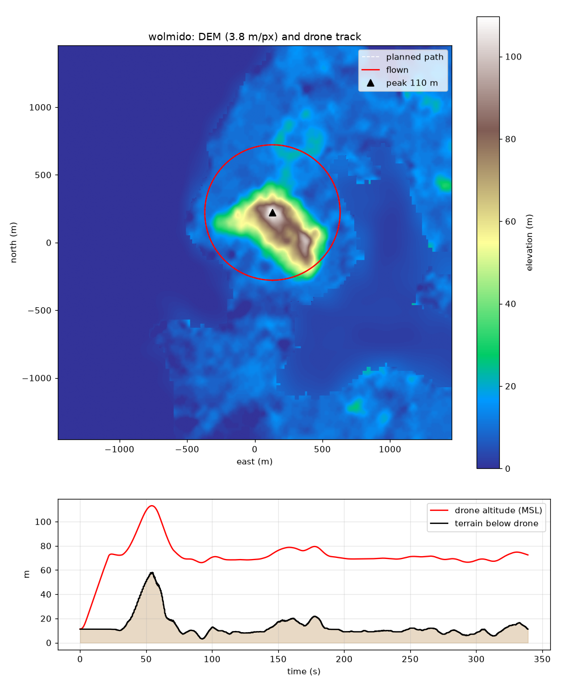

# island_drone_sim — 실제 섬 지형 위 드론 비행 시뮬레이션 (gym-pybullet-drones)

[learnsyslab/gym-pybullet-drones](https://github.com/learnsyslab/gym-pybullet-drones)의
Crazyflie 2.x 모델과 PID 제어기를 **실제 월미도·강화도 고도 데이터(DEM)** 위에서 비행시키는 최소 구현이다.
위성영상 텍스처는 없고(네트워크 정책으로 타일 서버 차단), 고도에 따른 색상으로 지형을 표현한다.

```
terrain.py        Terrarium 고도 타일 다운로드 -> numpy DEM -> PyBullet heightfield(충돌+시각) + 검증
island_aviary.py  CtrlAviary 서브클래스: plane.urdf 대신 heightfield를 지면으로 사용
fly_island.py     산 정상을 중심으로 선회 비행 + 로그/지도/영상 생성
```

## 설치 (Linux / macOS)

```bash
git clone https://github.com/learnsyslab/gym-pybullet-drones
python3.12 -m venv venv && . venv/bin/activate          # 저장소가 Python ^3.12를 요구
pip install -r requirements.txt
pip install --no-deps -e gym-pybullet-drones             # RL용 torch/SB3는 건너뜀
```

GPU나 디스플레이가 없어도 된다(PyBullet DIRECT 모드 + 소프트웨어 렌더러).

## 설치 (Windows)

PyPI에는 PyBullet의 Windows용 wheel이 없어서 `pip install pybullet`은 C++ 컴파일러(Visual Studio
Build Tools)를 요구한다. **conda-forge에는 Windows용 바이너리가 있으므로 Miniforge를 쓰는 것이 가장 쉽다.**

주의할 점:
- `C:\WINDOWS\system32`에서 작업하지 말고 사용자 폴더(예: `C:\dev`)를 만들어 그 안에서 한다.
- Windows PowerShell 5.x는 `&&`를 지원하지 않는다. 줄을 나누거나 `;`를 쓴다.
- `pip`가 "Fatal error in launcher"를 내면 `python -m pip`로 실행한다.
- `python3.12`라는 명령은 Windows에 없다. `py -3.12` 또는 `python`을 쓴다.

```powershell
# 1) 작업 폴더
mkdir C:\dev; cd C:\dev
git clone -b claude/ecstatic-franklin-nhsyss https://github.com/HSR2M/hsr1m
git clone https://github.com/learnsyslab/gym-pybullet-drones

# 2) Miniforge 설치 (https://conda-forge.org/download/) 후 "Miniforge Prompt"에서
conda create -n drones -c conda-forge python=3.12 pybullet numpy scipy gymnasium -y
conda install -n drones -c conda-forge matplotlib pillow transforms3d ffmpeg -y
conda activate drones
python -m pip install --no-deps -e C:\dev\gym-pybullet-drones

# 3) 실행 (GUI로 직접 보기)
cd C:\dev\hsr1m\island_drone_sim
python fly_island.py --island wolmido --gui
python fly_island.py --island wolmido --video --video_fps 1     # 영상은 ffmpeg 필요
```

conda 없이 가려면: Visual Studio Build Tools에서 "C++를 사용한 데스크톱 개발" 워크로드를 설치한 뒤
`py -3.12 -m venv venv`, `.\venv\Scripts\Activate.ps1`, `python -m pip install -r requirements.txt`
순서로 하면 PyBullet이 소스에서 컴파일된다(10분 안팎). Activate.ps1이 실행 정책에 막히면
`Set-ExecutionPolicy -Scope CurrentUser RemoteSigned`를 한 번 실행한다.

## 실행

```bash
cd island_drone_sim
python fly_island.py --island wolmido --agl 60 --radius 500  --speed 10 --video --video_fps 1
python fly_island.py --island ganghwa --agl 80 --radius 1500 --speed 10 --video --video_fps 0.5
python fly_island.py --island wolmido --gui        # PyBullet GUI로 직접 보기(로컬 PC)
```

| 인자 | 기본값 | 의미 |
|---|---|---|
| `--island` | wolmido | `terrain.ISLANDS` 프리셋 (wolmido: 3.8 m/px 2.9 km², ganghwa: 30 m/px 23 km²) |
| `--agl` | 60 | 지형 위 비행고도(m). 경로의 z는 평활화된 지형 + agl |
| `--radius` | 500 | 최고점 기준 선회 반경(m) |
| `--speed` | 10 | 순항속도(m/s). cf2x PID는 10 m/s까지 안정, 15 m/s는 뒤집힘 |
| `--climb_speed` | 3 | 이륙 수직상승 속도(m/s). 10 m/s로 올리면 수평 전환 때 뒤집힘 |
| `--max_err` | 0.6 | PID에 넘기는 수평 위치오차 상한(m). 게인이 27 g 기체 기준이라 크면 과도하게 기울어 추락 |
| `--max_err_z` | 0.08 | 수직 위치오차 상한(m). 수직 P 게인 1.25 N/m vs 무게 0.265 N이라 0.1 m만 넘어도 추력 역전 |
| `--vel_tau` / `--max_vel_err` / `--max_vel_err_z` | 1.0 / 1.5 / 0.25 | 목표속도 저역통과 시정수(s)와 속도오차 상한(m/s). 경로가 꺾일 때 급변 방지 |
| `--max_lag` | 8 | 드론이 경로점에 이보다 뒤처지면 경로점이 전진을 멈추고 기다림(m) |
| `--video` | off | 추적 카메라 프레임 저장 후 ffmpeg로 mp4 생성 (프레임당 약 0.7 s) |
| `--gui` / `--speedup` | off / 3 | PyBullet 창에서 실시간 보기. 카메라가 드론을 따라가며 `speedup` 배속으로 재생 |

출력은 `results/<island>_path.csv`, `results/<island>_map.png`, `results/<island>_flight.mp4`.

## 검증 결과 (이 저장소에 포함된 `docs/`)

| | 월미도 | 강화도(마니산) |
|---|---|---|
| DEM | 3x3 타일 z15, 3.8 m/px, 2.9 km² | 3x3 타일 z12, 30 m/px, 23 km² |
| 최고점 | 110 m | 459 m |
| 경로 | 반경 500 m 선회, 3.2 km | 반경 1,500 m 선회, 9.6 km |
| 비행시간(시뮬) | 339 s | 987 s |
| 순항 속도 | 10.0 m/s | 10.0 m/s |
| 순항 지상고 (목표 60 / 80 m) | 55–68 m | 46–104 m |
| 경로 추종 오차 최대 | 2.8 m | 2.4 m |
| heightfield vs DEM 레이캐스트 오차 | 0.00 m | 0.00 m |
| 물리 계산 시간(영상 제외) | 10 s | 30 s |

강화도 지상고 폭이 큰 것은 경로 고도를 σ=3 px(90 m) 가우시안 평활 지형 기준으로 잡아
날카로운 능선 위에서 실제 지형이 더 솟기 때문이다. `build_path(smooth_px=...)`로 조절한다.

 



## 데이터

- 고도: AWS Open Data **Terrain Tiles** (Mapzen Terrarium PNG, 무료, 키 불필요).
  한국은 SRTM/ALOS 30 m급이 바탕이라 월미도 z15 타일(3.8 m/px)은 보간된 값이다.
  더 정밀한 자료가 필요하면 국토지리정보원 DEM(공개 90 m, 5 m는 신청) GeoTIFF를
  `Terrain.heights`에 넣으면 그대로 동작한다.
- 건물: 포함하지 않았다. 브이월드 3D 건물(glb/obj) 또는 OSM 건물을 URDF/메시로 올리면 된다.
- 위성영상: 이 환경에서는 ESRI/VWorld/Google 타일이 모두 차단되어 고도 색상으로 대체했다.
  로컬에서는 `hypsometric_texture()` 대신 같은 범위의 정사영상 PNG를 `texture_path`로 주면 된다.

## 동작 원리

1. `load_dem()`이 중심 좌표 기준 3x3 타일을 받아 (768x768) 고도 배열을 만든다. 해수면 이하는 0 m.
2. `add_terrain_to_pybullet()`이 `GEOM_HEIGHTFIELD`로 충돌체를 만들고, Bullet이 heightfield를
   (min+max)/2 높이에 중심을 두므로 최저점이 z=0이 되게 올린다. `verify_terrain()`이 레이캐스트로
   DEM과 일치하는지 확인한다(오차 0.00 m).
3. `IslandAviary._housekeeping()`이 매 reset마다 기본 평면을 지우고 지형을 다시 올린다.
4. `fly_island.py`는 경로를 따라 "진행거리 s"를 속도 v로 전진시키고, 드론에서 `max_err` 이내로
   잘라낸 점을 `DSLPIDControl`에 목표로 준다. 속도는 `--accel`로 램프업하고, 상승 구간은
   `--climb_speed`로 따로 제한하며, 드론이 `--max_lag` 이상 뒤처지면 경로점이 기다린다.
   PID 게인이 Crazyflie(27 g) 기준이라 위치·속도 오차를 축별로 작게 잘라 넘기지 않으면
   경로가 꺾이는 곳에서 추력 벡터가 뒤집혀 추락한다(`--max_err_z`, `--max_vel_err_z`).
5. 생성 고도와 지상고는 픽셀 고도가 아니라 heightfield 표면 레이캐스트(`Terrain.surface_z`)로
   구한다. 30 m/px 지형에서는 둘이 수 m 이상 차이 난다.

## 한계

- Crazyflie 모델(수십 g)이라 실제 산업용 드론의 공력·바람은 반영되지 않는다. `Physics.PYB_DRAG`,
  `PYB_GND_DRAG_DW`로 항력·지면효과를 켤 수 있다.
- PyBullet 소프트웨어 렌더러는 heightfield 삼각형 118만 개를 매 프레임 그리므로 영상 생성이 느리다.
  실시간 시각화는 `--gui`(로컬) 또는 Unreal/Unity+Cesium 쪽이 맞다.
- 센서(카메라/라이다) 시뮬, PX4/ArduPilot 연동이 필요하면 PX4 + Gazebo(heightmap DEM) 또는
  Colosseum(AirSim) 쪽으로 가야 한다.
